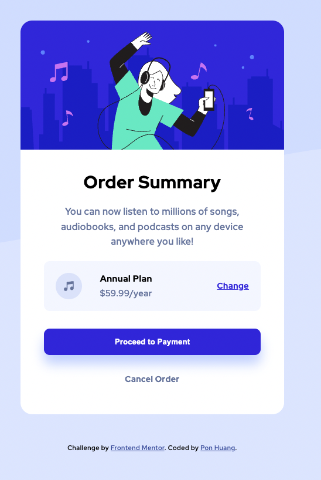

# Frontend Mentor - Order summary card solution

This is a solution to the [Order summary card challenge on Frontend Mentor](https://www.frontendmentor.io/challenges/order-summary-component-QlPmajDUj). Frontend Mentor challenges help you improve your coding skills by building realistic projects.

## Table of contents

- [Overview](#overview)
  - [The challenge](#the-challenge)
  - [Screenshot](#screenshot)
  - [Links](#links)
- [My process](#my-process)
  - [Built with](#built-with)
  - [What I learned](#what-i-learned)
  - [Continued development](#continued-development)
  - [Useful resources](#useful-resources)
- [Author](#author)
- [Acknowledgments](#acknowledgments)

**Note: Delete this note and update the table of contents based on what sections you keep.**

## Overview

### The challenge

Users should be able to:

- See hover states for interactive elements

### Screenshot

Complete


Hover effect



### Links

- Solution URL: [Add solution URL here](https://github.com/ponhuang/order-summary-component)
- Live Site URL: [Add live site URL here](https://ponhuang.github.io/order-summary-component/)

## My process

### Built with

- Semantic HTML5 markup
- CSS custom properties
- Flexbox
- CSS Grid
- Desktop-first workflow

### What I learned

When I set background-image: url() no-repeat;
then it didn't show the image in the end, and I found an answer from stackoverflow. (link is below).
We have to set it seperately with background property.

```css
body {
  background-image: url(images/pattern-background-desktop.svg);
  background-repeat: no-repeat;
  background-position: center top;
}
```

### Useful resources

- [CSS background does not show up when doing no-repeat](https://stackoverflow.com/questions/13594162/css-background-does-not-show-up-when-doing-no-repeat) - The best answer said: "The background-image CSS property should only be used to define the url of the image used. no-repeat belongs to the background-repeat property, and left corresponts to background-position. background groups all of those."

## Author

Pon Huang

- Instagram - [Pon Huang](https://www.instagram.com/ponhuang/)
- Art Blog - [une felt](https://une722.wordpress.com)
